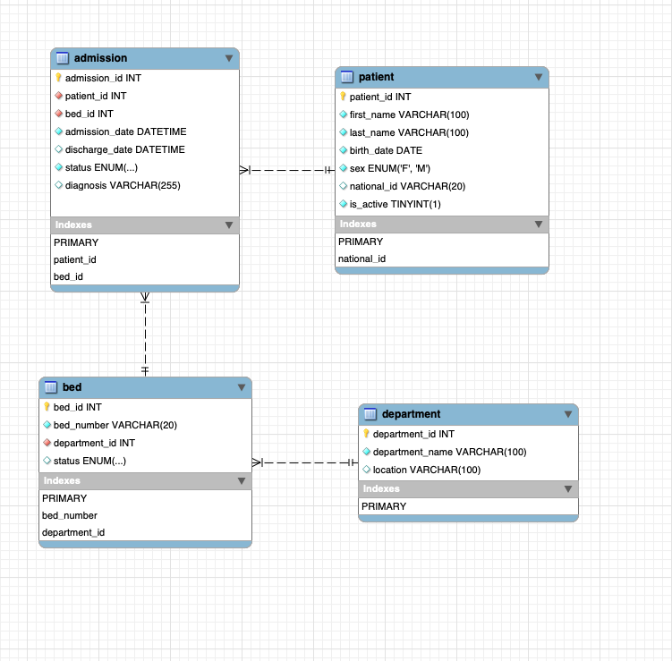

# MediCore DB — Hospital Operations Database System

MediCore DB is a production-ready relational database system designed to model, automate, and optimize real-world hospital operations, including patient lifecycle tracking, resource allocation, and clinical compliance.

---

## Project Highlights & Impact
* **Data Volume:** Powered by a procedural generation script supplying **+2,000 realistic clinical records**.
* **95% Performance Boost:** Query search space optimized via strategic indexation, dropping row scans from **2,020 to just 67**.
* **Enterprise Compliance:** Zero physical data loss enforced through custom **Soft-Delete** architectures and **automated system auditing**.
* **Data Engineering Pipeline:** End-to-end Python ETL process that extracts clinical data, applies transformations, masks sensitive PII data, and structures analytics assets.


---

## Core Database Architecture

### 🔹 Business Logic Layer (Stored Procedures)
* `sp_admit_patient`: Validates patient status, automatically assigns available beds, and creates operational admission entries.
* `sp_discharge_patient`: Safely closes clinical workflows and frees up physical hospital beds in real-time.

### 🔹 Security & Compliance (Triggers & Soft Delete)
* `trg_prevent_patient_delete`: Blocks physical `DELETE` commands on patient records, forcing a safe `is_active = 0` state (Soft Delete).
* `trg_bed_status_change`: Automatically tracks infrastructure shifts into `bed_audit_log`, capturing the database `USER()` and timestamps.

### 🔹 Advanced Analytical Layer (Views & Window Functions)
* `vw_current_admissions` / `vw_bed_occupancy`: Real-time operational KPIs for hospital staff.
* Time-Series & Multi-Level Rankings: Analytics utilizing complex `RANK()` and `ROW_NUMBER() OVER()` statements.

### 🔹 Data Engineering Layer (Python ETL Pipeline)
* **Automated Extraction:** Connects programmatically to MySQL via `pymysql` to pull operational data.
* **Privacy Transformation:** Uses `pandas` to mask sensitive national identifiers (RUTs into `XX.XXX.XXX-X`) following healthcare data protection standards.
* **Feature Engineering:** Dynamically computes accurate historical patient ages at admission and calculates exact clinical lengths of stay.
* **Flat File Load:** Automatically generates a secure, production-ready corporate CSV asset (`clinical_reporting_extract.csv`) optimized for BI tools.

---

## 📁 Project Structure

The repository follows a clean, execution-ordered deployment pipeline:

```text
MediCore_DB/
├── 01_schema/
│   ├── schema.sql              # Core DDL & Relational Schema (Soft-Delete enabled)
│   ├── seed_data.sql           # Initial testing baseline
│   └── seed_data_expanded.sql  # Procedural loop inserting +2,000 massive records
├── 02_business_logic/
│   ├── procedures.sql          # Intake & discharge workflows
│   └── triggers.sql            # Deletion blockades and audit captures
├── 03_analytics/
│   ├── queries/                # Window functions, basic, and analytical queries
│   └── views.sql               # Abstraction layer for administrative reporting
├── 04_optimization/
│   └── indexes.sql             # EXPLAIN-driven index strategies
├── 05_audit/
│   └── audit_tables.sql        # Compliance and system tracking data logs
├── 06_etl/
│   ├── etl_pipeline.py         # Python automation script (Extract, Transform, Load)
│   └── clinical_reporting_extract.csv # Privacy-compliant reporting asset generated by Python
└── README.md
```

---

## Optimization Verification (EXPLAIN Baseline)

To prove performance stability under load, the active hospitalization reporting query was stressed under a **2,020 row baseline**:

* **Before Optimization (No Indices):** `Table scan on admission (type: ALL)`. Evaluated **2,020 rows** sequentially.
* **After Optimization (`idx_admission_discharge_date`):** Switched to `Index lookup (type: ref)`. Rows evaluated dropped to **67** (Over **95% database overhead reduction**).

## ERD

> **Note on Database Performance:** The ERD above displays the default constraint-generated indices (Primary Keys, Foreign Keys, and Unique constraints). Custom operational indices designed to optimize analytical queries (such as `idx_admission_discharge_date` and `idx_patient_active`) are cleanly separated and deployed via the `04_optimization/indexes.sql` pipeline to avoid schema clutter and ensure modular performance tuning.

---

## 🛠️ Tech Stack
* **Engine:** MySQL 8.0+
* **Languages & Ecosystem:** SQL (DDL/DML), Python 3.x (`pandas`, `pymysql`)
* **SQL Paradigms:** DDL/DML, Procedural SQL, Window Functions, Database Indexing, Triggers, Query Optimization.

---

## 👩‍💻 Author
**Valentina Hernandez**  
*Data Engineering & Database Design Portfolio Project.*
